# UI Documentation

After initial setup, the usage of the web UI is completely optional and not necessary, but useful.

### The login page
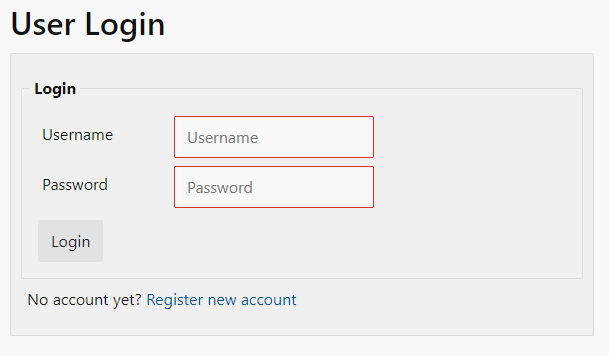

Login is executed with username and password, email is irrelevant.
Red border means the field is required.
The username/password authentication can be disabled in the system settings. In that case
everyone can access the web UI without any authentication at all, which is the initial default.

### The registration page
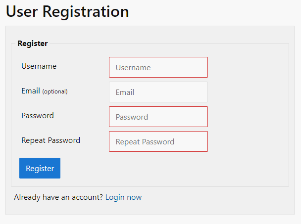

An email address is optional, since it will only be used for two things: password resets
and notifications (coming a future milestone).
The registration process can be disabled in the system settings. 
Currently, there is no minimum password length. The maximum password length is 200 bytes.

### The dashboard
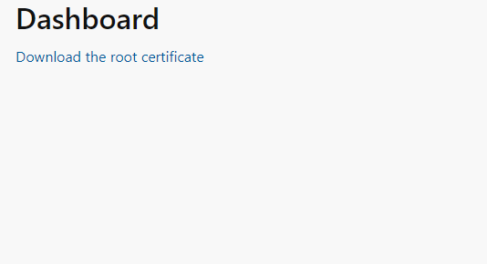

The dashboard is still rather empty, only offering the option to download the root certificate.
There will be more options in the future.

### The certificate list
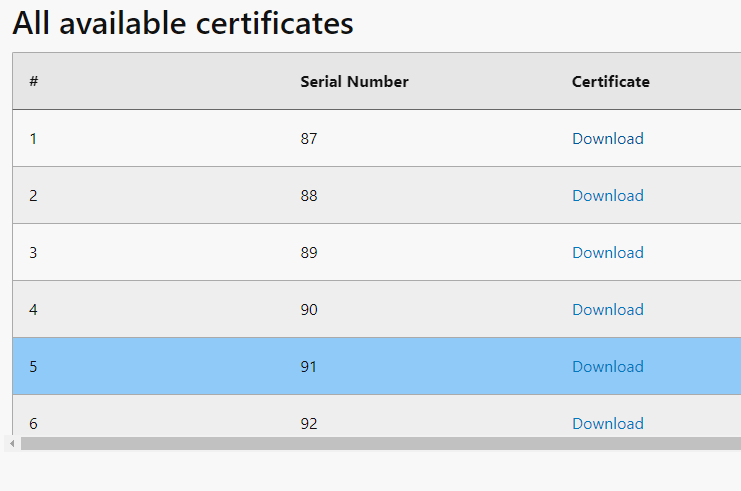

The certificate list displays all certificate you ever requested and offers the option download
them manually. If it was a "simple mode request" you can download the corresponding private key
as well.
There is also an option to revoke a certificate (coming in a future 
[milestone](https://github.com/KaiserWerk/CertMaker/milestone/3)).

### Add a new certificate (simple mode)
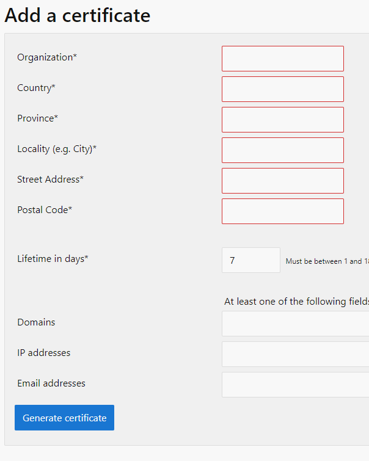

Generate a new private key and certificate, signed by the CA, with the supplied information.
Multiple values for domains, IPs and emails should be separated by a comma.

### Add a new certificate with a CSR (normal mode)
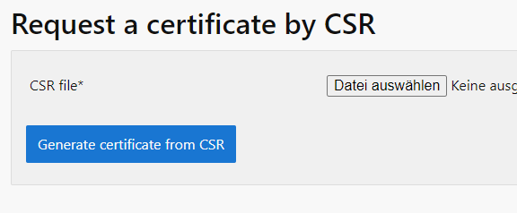

If you already have a private key, you can create a 
[Certificate Signing Request](https://en.wikipedia.org/wiki/Certificate_signing_request) and 
upload it here to create a new certificate (but no private key) from it.

### System Settings
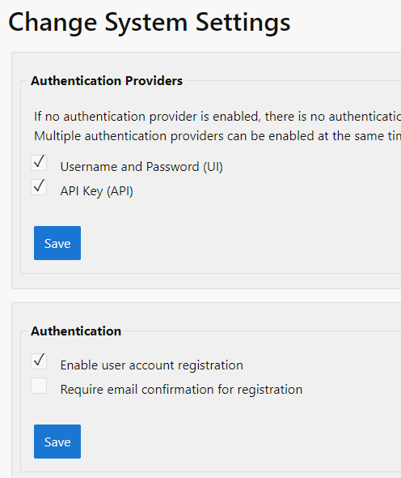

Here, as an administrator, you can change multiple important and helpful settings to adapt
*CertMaker*'s behaviour to your requirements.
Challenges for creating new certificates do __NOT__ apply to the web UI.
Email confirmation, certificate revocation as well as file copy retention settings are 
not functional yet.

### User list
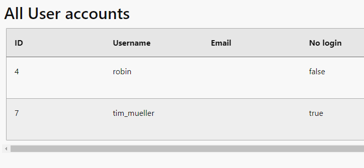

Here, as an administrator, you can see data of, edit and remove all existing user accounts 
as required. __Nologin__ means the user cannot log into the web UI, but can still use the API.

### Add user
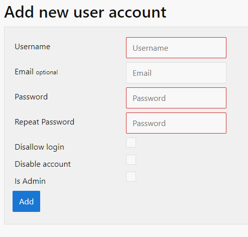

Supply some information and a new user is on his was. Change the settings according to your needs.
If you need an API user, leave the email blank and check the 'Disallow login' checkbox.

### Your profile
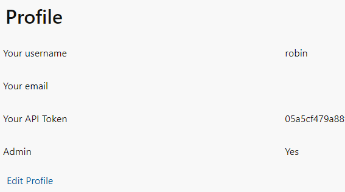

When you're logged in, the profile shows your own basic account information along with your
current API token. There is also a link to edit your profile.
Only yourself can see/edit this page.

### Editing your profile
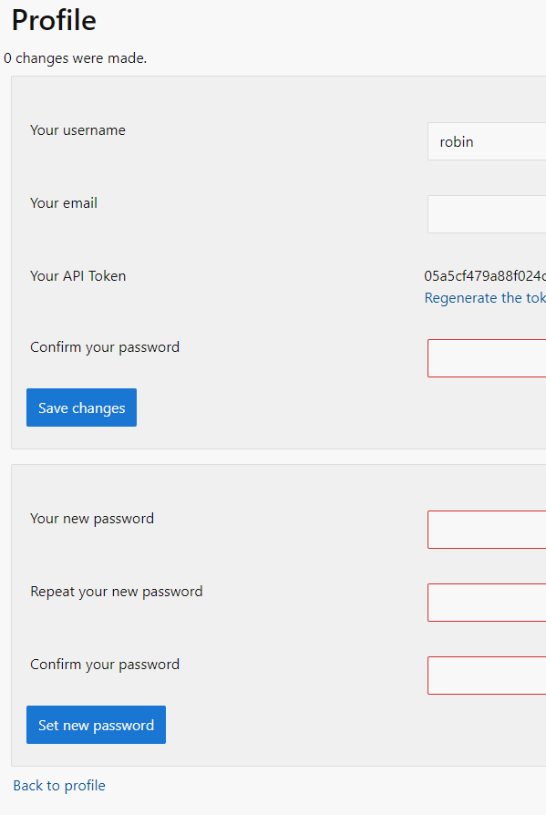

Here, you can change your username and email (if not already taken), regenerate your API Token
and change your password.

